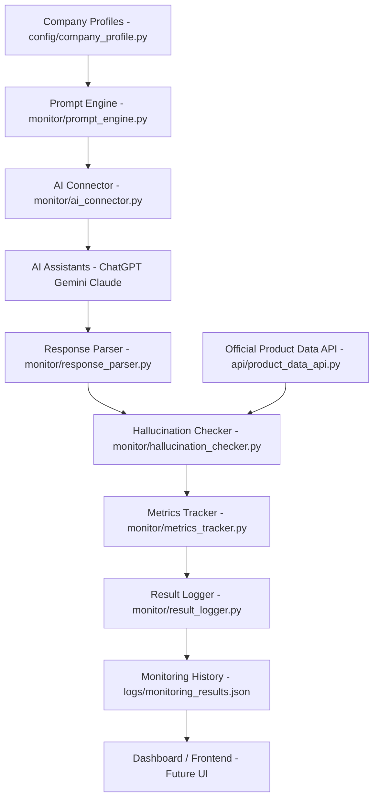

# System Architecture

```mermaid
flowchart TD

A[Company Profiles - config/company_profile.py]
B[Prompt Engine - monitor/prompt_engine.py]
C[AI Connector - monitor/ai_connector.py]
D[AI Assistants - ChatGPT Gemini Claude]
E[Response Parser - monitor/response_parser.py]
F[Official Product Data API - api/product_data_api.py]
G[Hallucination Checker - monitor/hallucination_checker.py]
H[Metrics Tracker - monitor/metrics_tracker.py]
I[Result Logger - monitor/result_logger.py]
J[Monitoring History - logs/monitoring_results.json]
K[Dashboard / Frontend - Future UI]

A --> B
B --> C
C --> D
D --> E
E --> G
F --> G
G --> H
H --> I
I --> J
J --> K
```
